## Document—Aerith

### About Project

#### Target

此项目为2022年数据库课程设计大作业：基于umijs&nestjs的web网站--【Aerith's game Froum】。旨在对web技术框架：react,umjs,nodejs,nestjs的学习。

**注：** 本项目开发从文档分析，组件设计，界面编写到代码测试都由本人独立完成。

							

#### Name


**Aerith：**


爱丽丝·盖恩斯巴勒（英文：Aerith Gainsborough；日文：エアリス ゲインズブール），是日本史克威尔公司旗下作品《最终幻想Ⅶ》系列中的女主角之一。性格与外表不同，意外积极大胆，活泼开朗，乐观幽默，有点喜欢小恶作剧，调皮又充满活力，情感细腻温柔。

### Technology selection

| Modules  | Version   | Directory |
| -------------------------------------- | --------------------------------------- | --------------------------------------- |
| ✅React                                 | 17.x                                    |                                         |
| ✅Mysql                                 |                                         |                                         |
| ✅Javascript                            | ES2015                                  |                                         |
| ✅Typescript                            |                                         |                                         |
| ✅Umijs                                 | 3.5.23                                  |                                         |
| ✅Nestjs                                | 8.0.0                                   |                                         |
| ✅Less                                  | 4.1.0                                   |                                         |
| ✅Antd                                  |                                         |                                         |

### Function Introduction

### Presentation

#### **beta1---2022/4/30**

★**以下画面不代表最终项目画面**

#### **Show by pages:**

```tex
Pages:
	AboutPoj,
	AddArticle,
		Content,
	Archives,
	ArticleDetail,
		ArticleComment,
	FeedBack,
		FeedBackCard,
	Gossip,
	Home,
	Login,
	Official,
		OfficialCard,
	Search,
	Strategy,
		ModelCard,
	UserInfo,
		AboutAerith,
		AboutHaruluya,
		MyComment,
		MyFans,
		MyFocus,
		MyInfo,
		MyLevel,
		MyPost,
```

**①Home：**

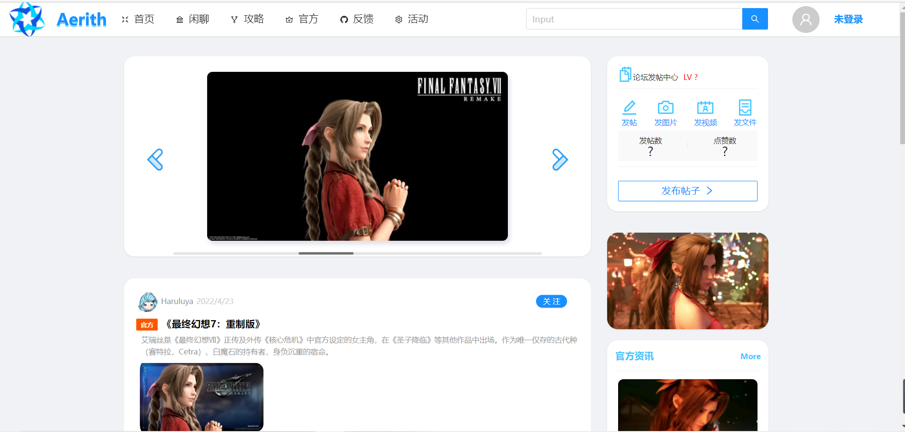

**②Login**

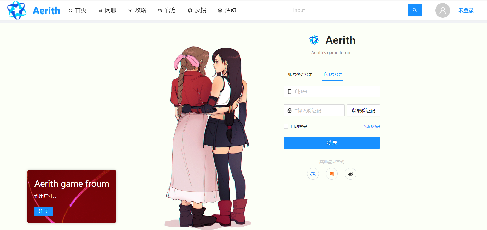

**③Gossip**

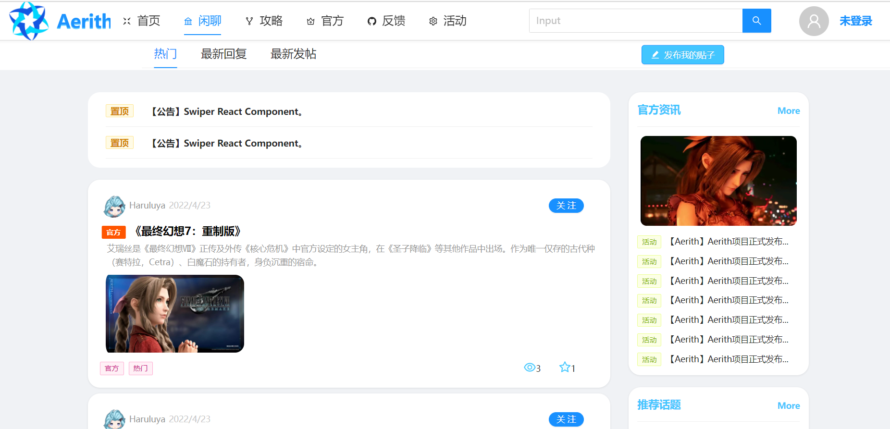

**④Strategy**

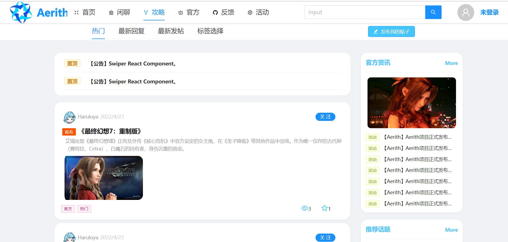

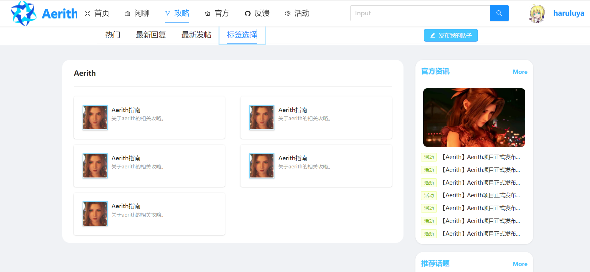

**⑤Official**

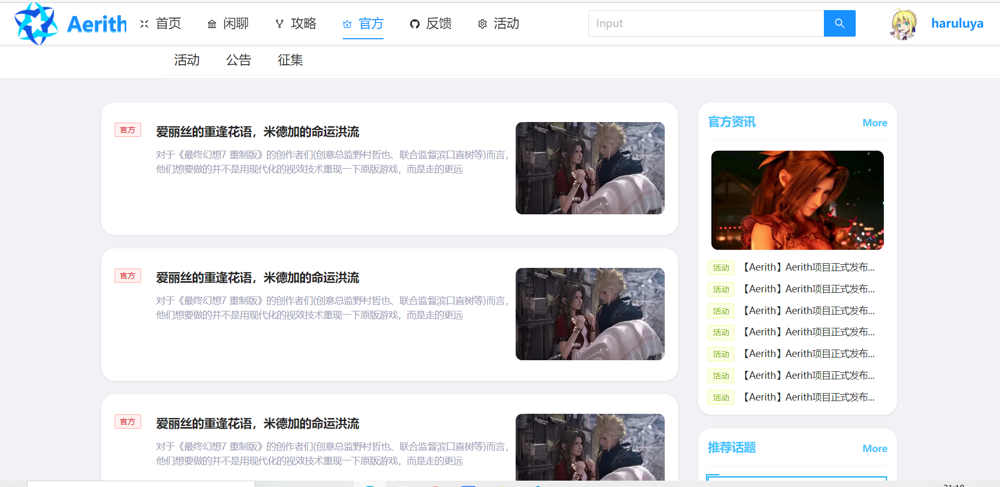

**⑥FeedBack**

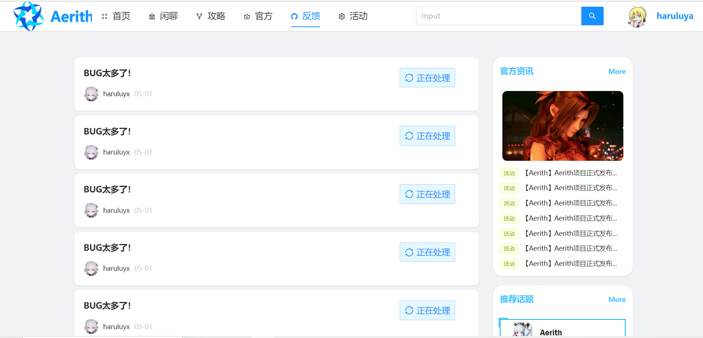

**⑦UserInfo**

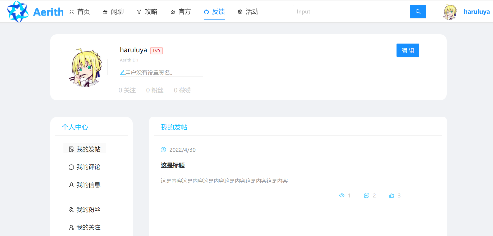

**部分子路由组件：**

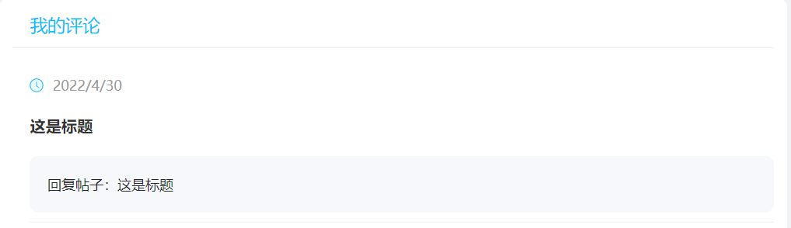

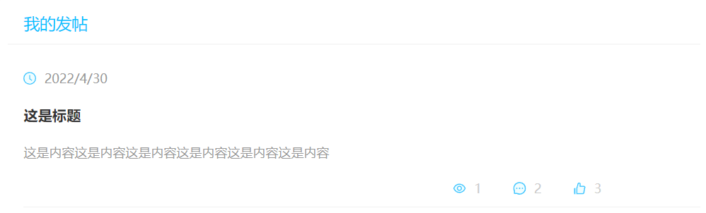


**⑧ArticleDetail**

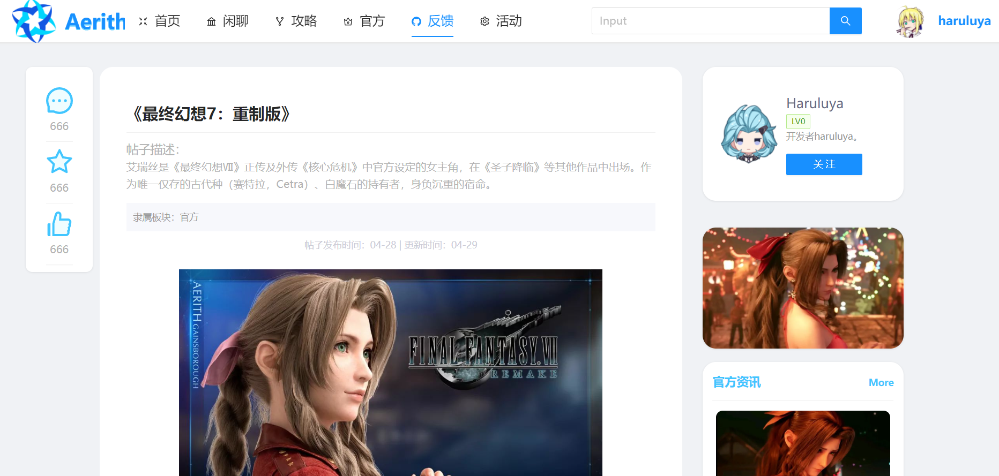

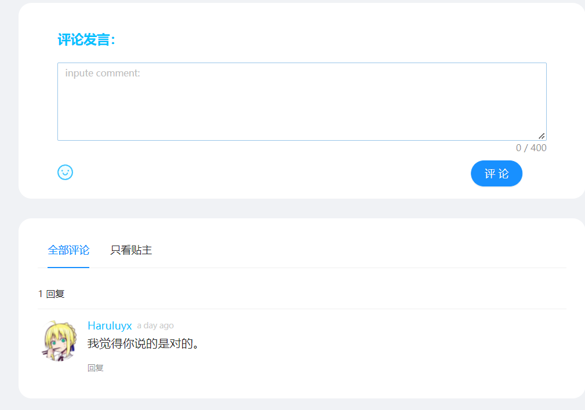

#### **Show by components:**

```tex
components:
	ArticleCard,
	ArticleCreate,
	ArticlePre,
	Comments,
	DIYmodal,
	Footer,
	Header,
	ImgSwiper,
	NavCard,
	NavTag,
	OfficialInfo,
	RecTopic,
	RecUser,
	Register,
	TopMessage,
	UserComment,
	VideoCard
```

### About author


